# Process Journal

## Tiny Game | 01.23.25

### Dumb Ways to Fall Level 1 Design :  
 
I began the design of the first level of my small platformer game. I first got familiar with the elements of PocketPlatform which is a tool on itch.io that allows users to quickly design a platformer game with the look and the feel of a Mario game. I first began with exploring how to set the background of the game, and added decorative elements like clouds. I also wanted to interact with dangerous objects of the game like the fire spots so when the player touches them he instantly restarts the level because the character instantly died. 

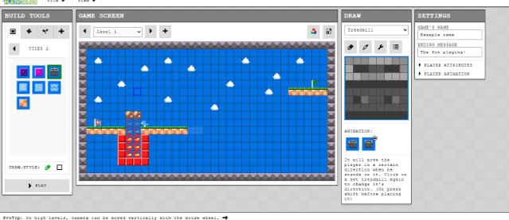
 
I then continued to design the first level. I got more familiar with other objects of the game such as ice  blocks which are slippery to make it harder for the player to reach the end of the level. I also added an enemy to the beginner to the game as well as an underground passage where the player can collect double 
ability to jump. 

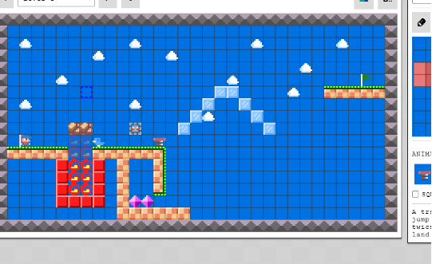
 
As I continued the design of the first level I have encountered issues like trying to make a challenging enough level for the player. I feel like so far the level that I have designed is a bit too easy so I found the portal object in the platform designer and placed it in the secret passage  which would teleport the player to the end of the level. I also added blocks that disappear when they are touched. 

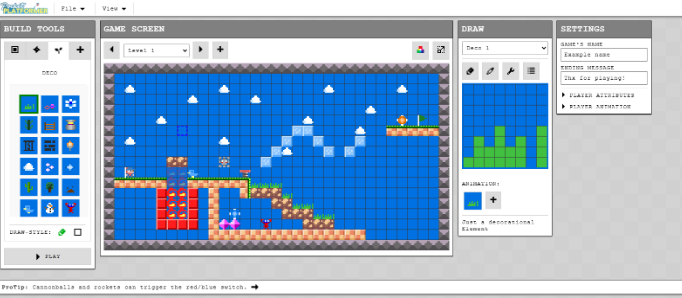

For the end of the level I added some difficulty to the game which is to place secret objects on blocks which when touched, instantly kill the player. I also placed a sign which instructs the player to find a secret passage. I also added a second portal to the beginning which is easier to reach if the player falls from the ice blocks. 

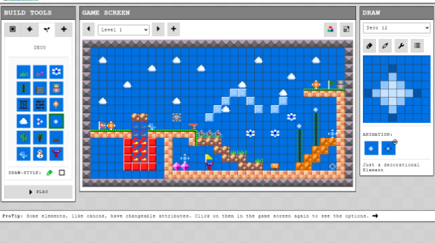
 
### Level 2 Design :  
 
For the design of the second level I have begun making it look pretty by adding clouds. 

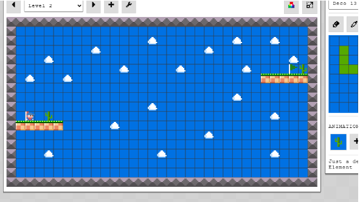

I continued the design of the second level by making it winter themed. I added an underground passage with enemies that the player will have to cross if he wishes to collect coins. In fact, I implemented a coin system for this level . There is also a hole in the blocks so if the player falls through to the right he 
instantly dies.  

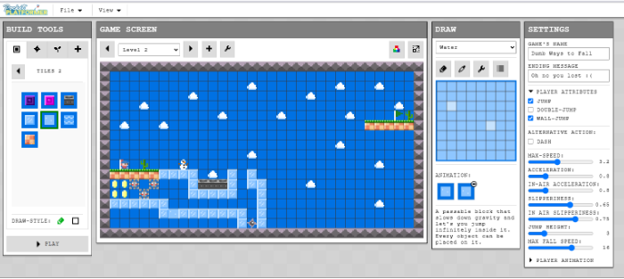
 
While continuing to work on the level, I have added a rocket launcher so when the player jumps on blocks to the end of the level, he has to do so quickly enough or he will get eliminated. The player must also jump on the purple blocks quickly enough because the purple blocks disappear when they are touched. 

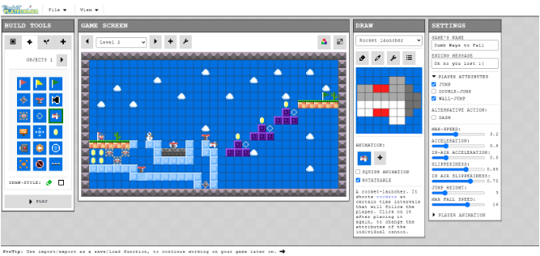
 
Finally to end the level, I have put fire and spiky blocks so if the player falls he instantly restarts the level. If quick enough, the player can also collect coins . However, this part of the level is a trap because it’s virtually impossible for the player to get to the end of the level. 

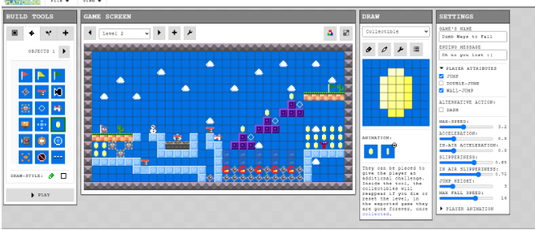
 
We tested my game in class, and people loved it. They even tried to speed run the game. 

## floatSquare | 01.30.25

### Prototyping with Unity :  

For this first Unity prototype, I have had a lot of issues with instaling Unity on my laptop. I have reinstalled the program several times and have changed editor versions. I have found that version 6000.0.34f1 works best on my computer. I also had to disable roles of Windows Defender because my Unity Projects were not building. Finally, I had to reinstall packages to make my project run without errors.

Since I have spent so much time debugging Unity , and my project, I did not have time to build an in-depth prototype on Unity. Instead, I have focused on learning the basics of Unity by following a 2D tutorial, and trying to replicate the same result on my end on unity. Here is the tutorial that I have followed for this prototype : https://www.youtube.com/watch?v=XtQMytORBmM&ab_channel=GameMaker%27sToolkit. In the future, I wish to modify this game to create a improved and more intresting version of floppy bird, a well-loved game that I used to play on my phone when I was younger.

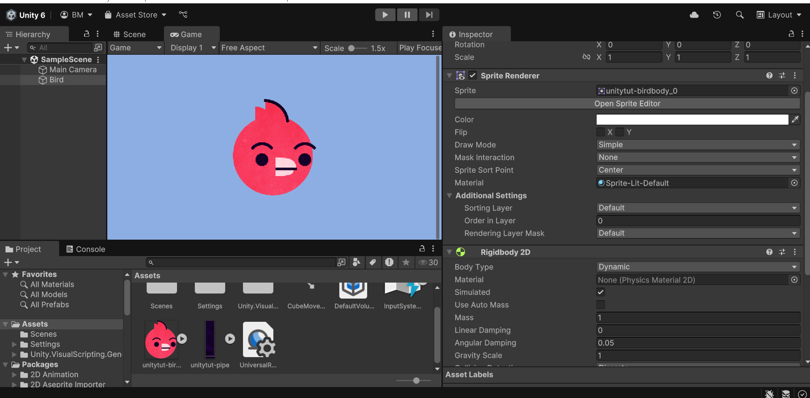

I started my prototype by creating a Bird GameObject, and setting the .png bird image  as the Sprite Rendere Image. I also added a RigidBody object which would allow me to move the bird object.

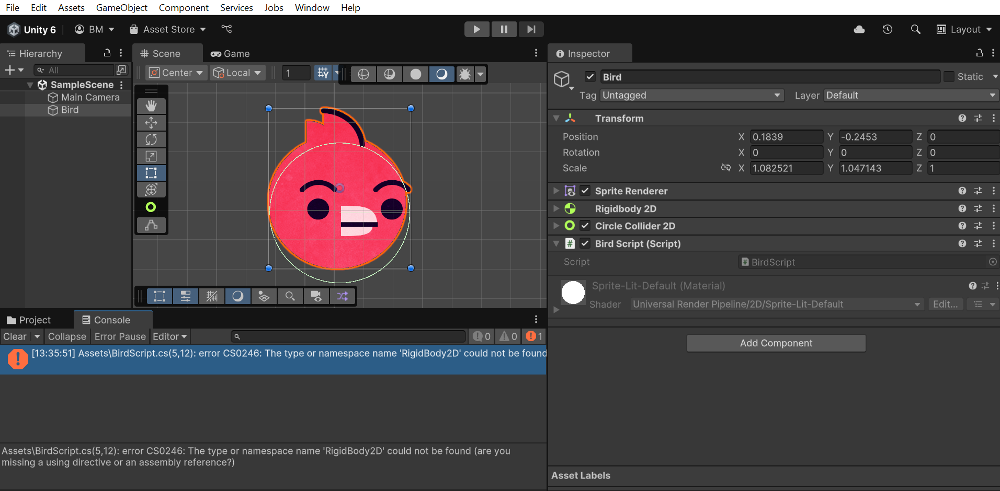

I added a Circle Collider on my Bird object. I also created a script BirdScript which would allow me to control the bird object with the touch of the space bar. As you see, I was having issues with the script file that was not recognizing the 2DRigidBody.

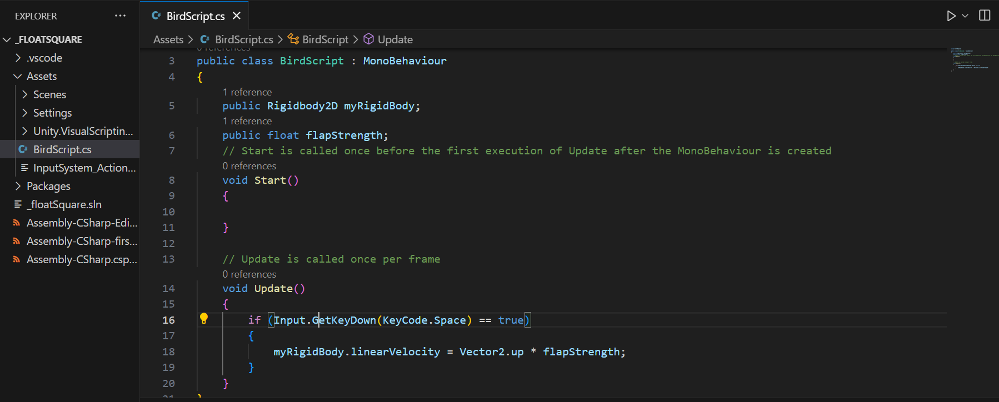

Here is a screenshot of my BirdScript.cs file where the Update method implements control of the KeyCode.Space.

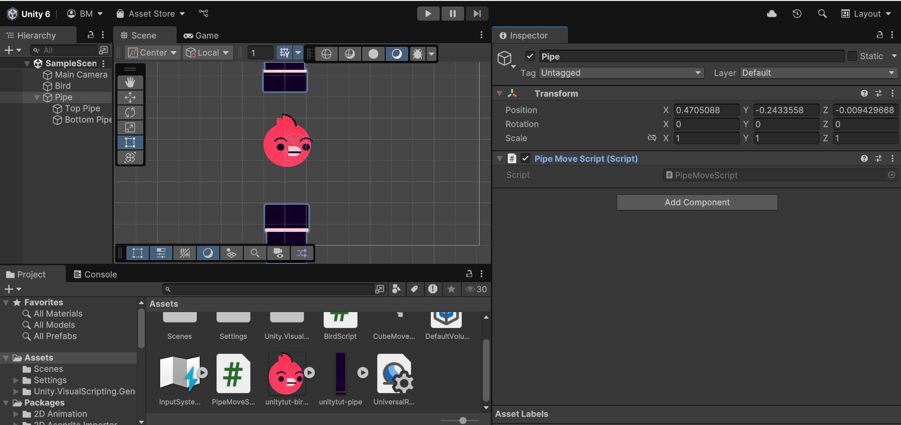

I started by creating A Pipe GameObject with two GameObjects inside it including a Top Pipe and a Bottom Pipe. Each GameObject has a Pipe .png image set inside a Sprite Rendered. Also, each Pipe has a Script file to control the speed and position.

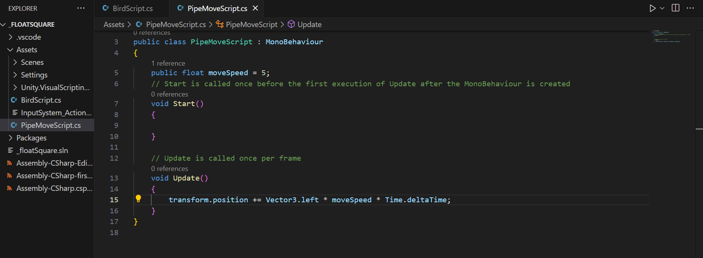

Here is a screenshot of the PipeMoveScript which controls the speed and transforms the position of each pipe.

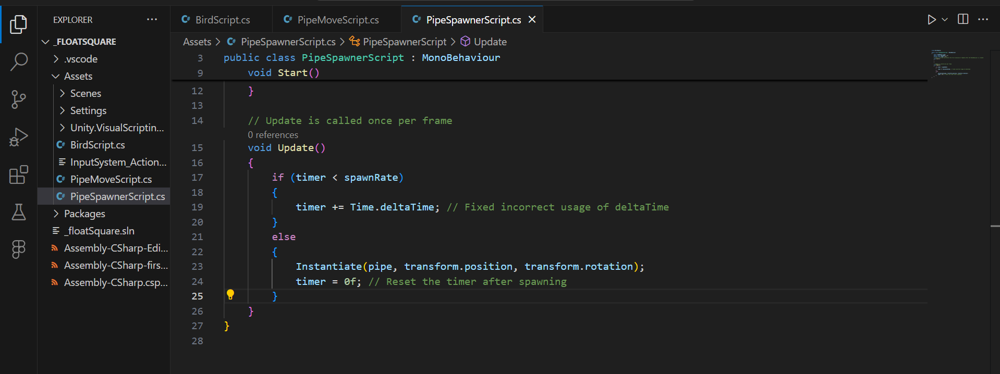

I created a prefabricated object Pipe which contains the Top and Bottom Pipe objects. I also created a PipeSpawner script which geneartes Pipe objects as you play the game.

## floatSquare part 2 | 02.06.25

### Prototyping with Unity :  

I decided to continue working on my protype from last week this week, because the game was 
missing things like a points system, a game over system, and more controls.
Here is a screenshot of what the game looks like at the beginning of this 
prototype with the bird jumping through pipes.

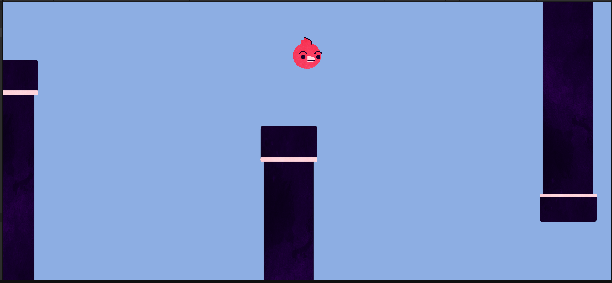

To make sure the bird disappears after it touches the pipe that is not in between
the pipes.

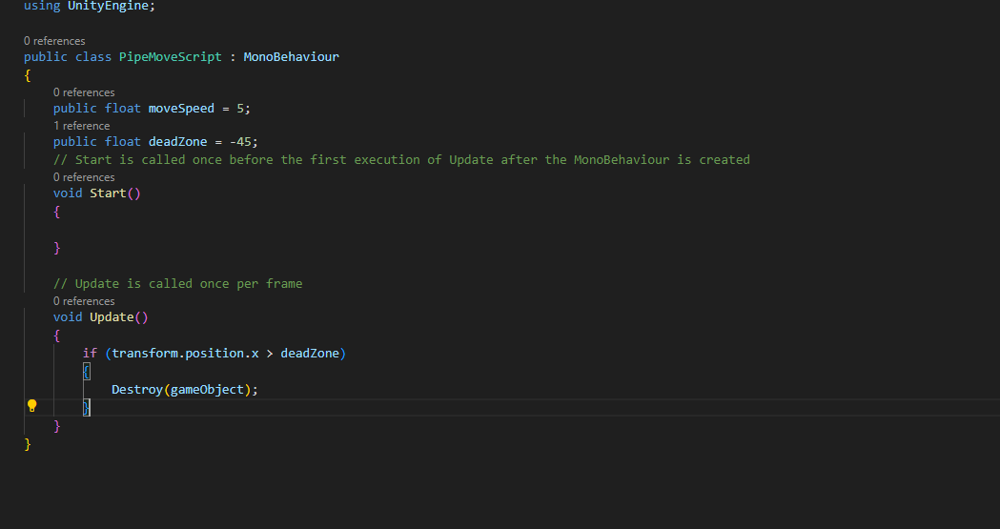

In this message you can see me adding a box collider in between the space of both pipes.
I will also be adding a script file to the middle of the prefabricated
pipe object.

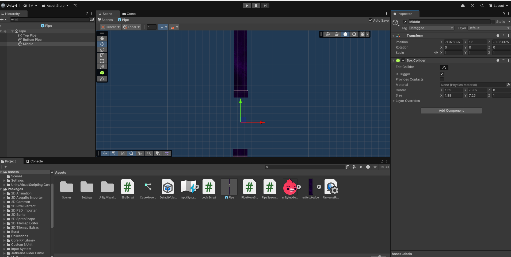

In this script, I am adding a getter for a Logic tag script. To make sure this works 
in Unity, I need to add a Logic tag.

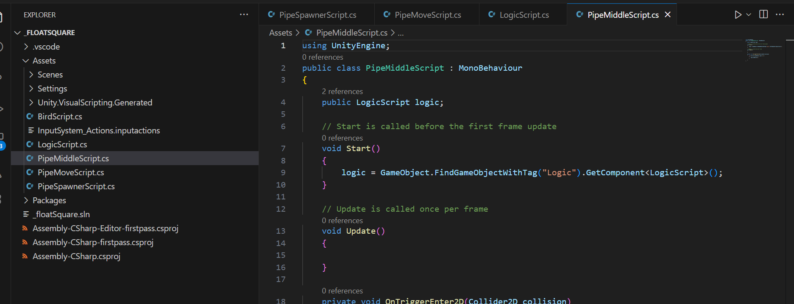

In the SampleScene I am adding a new text object after a score text object.
I also added a Restart button under the GameOver text which triggers the game 
restard when pressed.

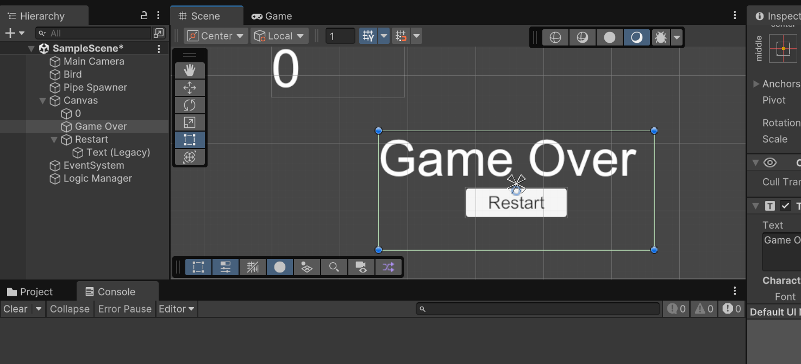

The LogicScript.cs file is responsible for implementing the game logic.
It implements logic like score increase, game restard, and game over.

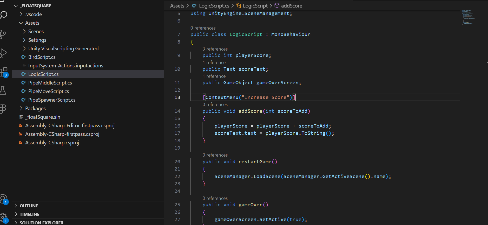

## Sewing Master | 02.13.25

### Prototyping with Storyboard :

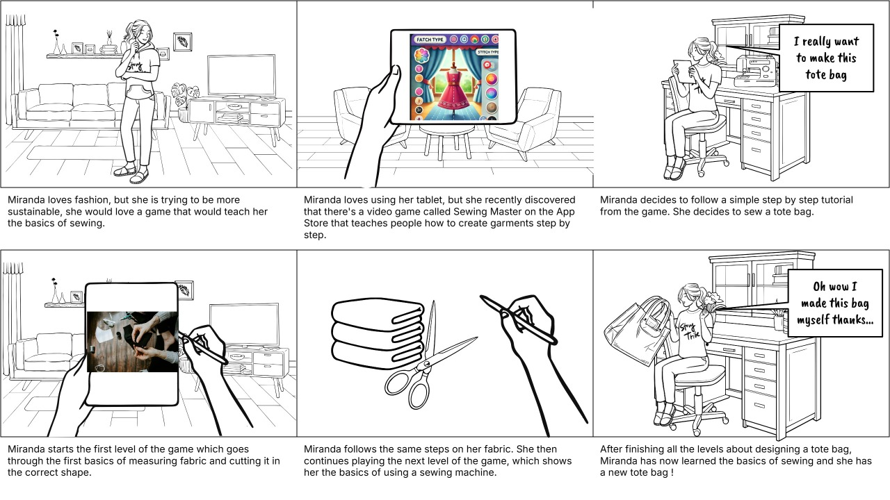

For this week, I decided to try a new form of prototyping with StoryBoard. This 
is a prototype for a sewing game. The sewing game would be available for tablet-type devices and will allow users to play through different levels 
of sewing an item . At the same time users are encouraged to follow the game
steps in real life, as the steps they play through in the game are actual instructions about how to sew an item while they learn the basics of the sewing skills.

Here are some key elements of the Sewing Master game.

- Avatar Customization : Players can customize their avatars. Including changing their clothes, hair accessories
- Increased difficulty with the levels : As the player progresses
in their knowledge with sewing, and completes more levels, the difficulty 
of the game increases. 
- Possibility to select different stiching and Sewing Machine tools according
to the tools that the user has at home : This would allow for better learning 
for the player as it would be easier for them to follow the same steps in real life as they learn to use their tools.
- Possibility to learn extra points : Players can earn extra points by submitting pictures of their finished product to the game.
- Unlock exclusive levels with new patterns and tutorials by competing with other users globally : This would encourage players to complete more levels of the game and rank higher on the global leaderboard.

## Light Orbs | 02.20.25

### Prototyping with Storyboard :

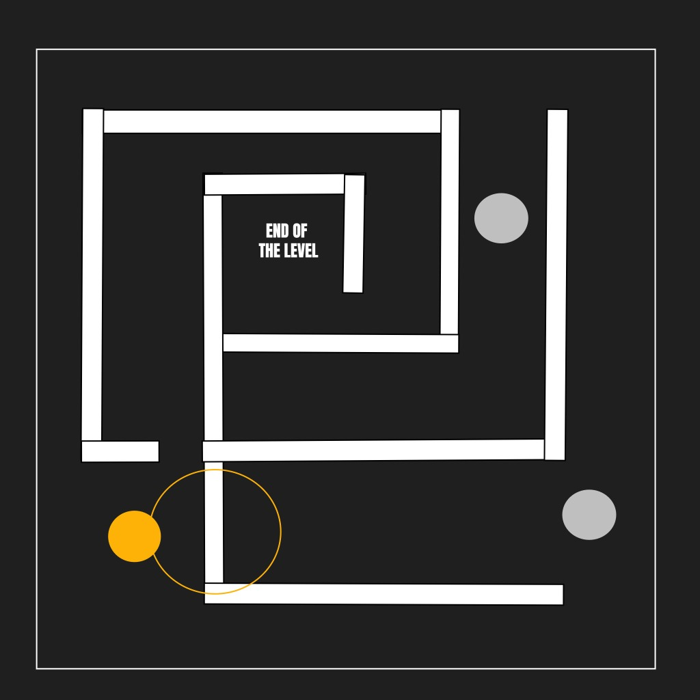

For today's week I had the idea to create a game prototype where a player 
plays as a light orb where light is a limited resource . As the player 
goes through a labyrinth light from their orb which is their character.
The player must collect lights as they go though the labyrinth. Shasow monsters
roam the labyrinth, and steal your light source. Can you escape these shadow 
monsters and reach the end of the tunnel before you run out of light ?

# Gameplay 

- Some parts of the tunnel only appear when you shine enough light
on them.
- Enemies can sense your movement, and steal your light as you move 
through shadows 
- Staying too long in one place dims your light of your orb.
- You can dim or increase your glow as you go through the tunnel.
- Levels increase difficulty as you move through them 
- As the level number increases, the number of monsters increase.
- Secret shadow paths are opened as the player advances through the tunnel.

## The Bat that Wasn't | 03.05.25

### Main Idea : 
For my first iteration prototype, I have chosen my idea of doing a 2D platformer video game where you play as a bat against mice.
I have gotten this idea in class while thinking of a funny plot twist for a horror-themed video game. In fact, the game would begin
as you, Dracula accidentally transforming into a mouse. Dracula would be forced to survive in a world of mice. However, when reaching
a higher level in the videogame Dracula would be able to transform into a bat. The game would be based around puzzles, and
trying to solve these puzzles. 

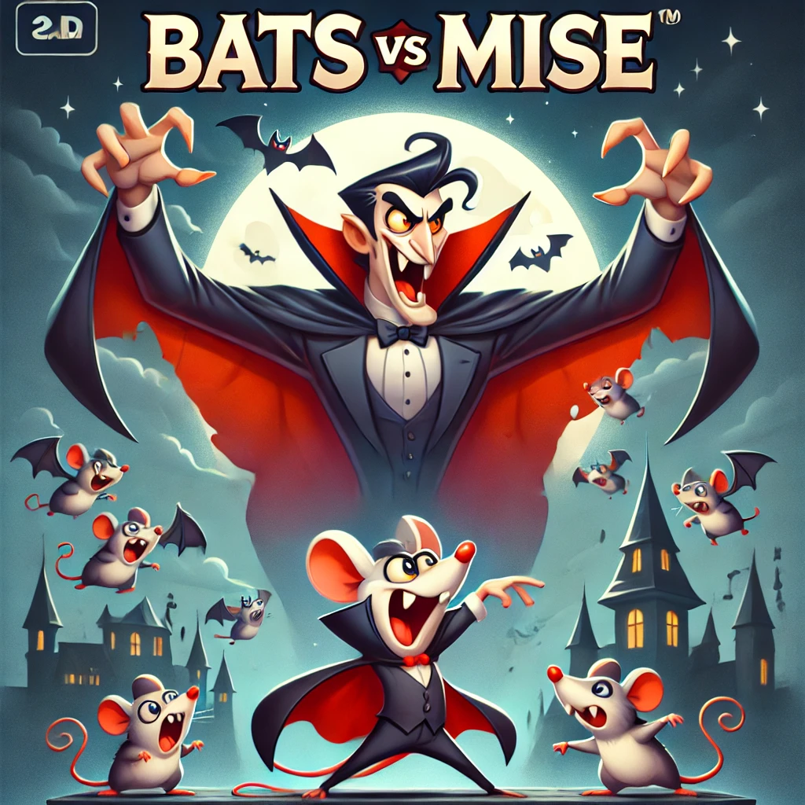

### Questions I am trying to answer : 

1. What would be an intresting name for my game ? 
2. What kind of puzzles, enemies, and obstacles can I integrate into the game ?
3. How many levels would my game be ?
4. How can I implement humour as a core feeling in my game to keep users engaged ?

### Describe the type of prototype :

This prototype is a look/feel and role concept with a closer look at 
main plotline and design of characters. My main goal for this prototype 
is to showcase the uniqueness of my 2D Platformer. Since my game centers 
around Dracula, and mice, I want my game to be in a humoristic gothic style.

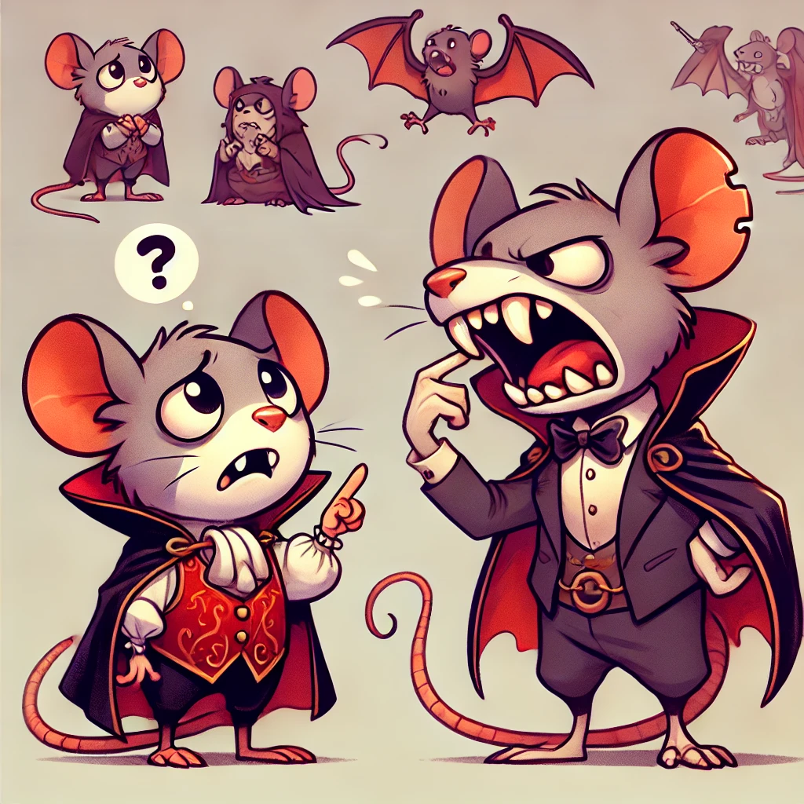

### Fidelity level of the prototype :

For this first prototype, I am currently dealing with fidelity at conceptual level.
I want to be closer to finishing brainstorming for the main elements of the game such as 
look, character design, name, main gameplay mechanics. This would allow me to work more
in detail with the visual aspect of the game in my next prototype as I will already have
my starting assets to begin developping each level.

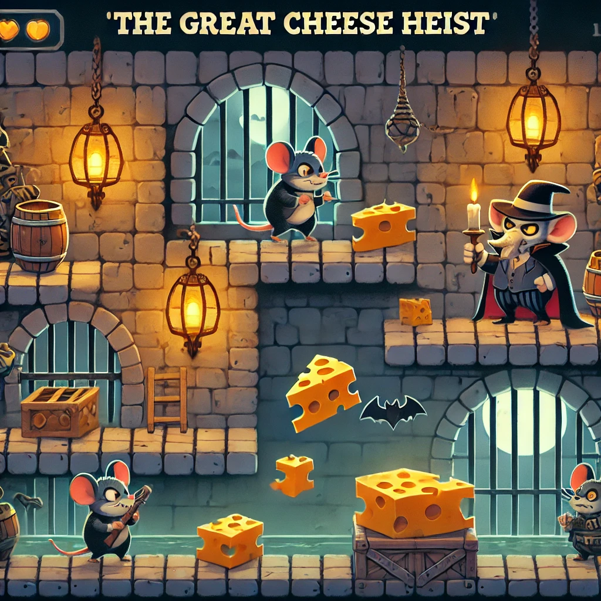

### Learned Lessons 
- Humoristic storylines, and an attractive level-design can make the game more engaging for players.
- Changing between the mice/bat form as Dracula could allow me to use different mechanics when it comes 
to navigating puzzle-style levels.
- Character development is crucial when it comes to game design. In fact, it makes the story feel more rich.

### Next Steps 
- Write a detailed storyline and  script for each of the levels.
- Create a first-level prototype applying the visual style of the first prototype.
- Reflect on game mechanics. What kind of functionalities will the game have. 
- Create and test the early transformation mechanic when Dracula turns into a mouse.

## Fang & Claw: A Grabby Situation | 03.13.25

### Main Idea : 
For my second iteration prototype, I have decided to go a bit different than my first prototype. I decided to change the form of my game, and make it a claw style game inspired by the arcade I have recently visisted myself. I still want to stick to my initial idea of vampires and mice. However, I decided to change the name of the game to : Fang & Claw: A Grabby Situation to have a funny approach to my initial idea. Since I do not have a lot of weeks left to work on my final project, I have decided to build my game on simple concepts, and improve the game upon each iteration.

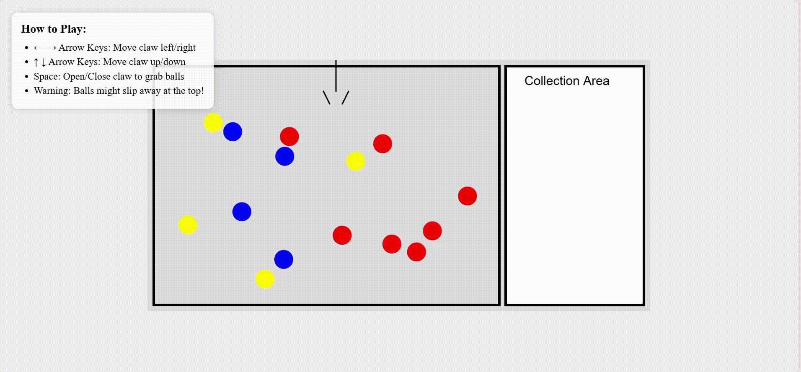

## Questions I am trying to answer : 
- How can I create engaging game mechanics that would allow me to simulate the look and feel of a claw machine that can be found at a physical arcade ?
- How do I provide feedback to players when they catch/lose a ball?
- How do I balance between a challenging but visually fun game to strike the perfect balance between cozy and funny ?

### Describe the type of prototype/fidelity level/tools :
- The type of prototype I was working on this week is an implementation prototype. 
- The fidelity level of this prototype is medium to high because I have started to explore the game look/feel and controls.
- The tools that I have used for this prototype are : html, css, JavaScript, the p5.js library (as I have experience in building games with p5.js)

### Learned Lessons 
- Visual feedback is crucial for players.
- Using randomization for simulating ball positions helps
in giving a more realistic feel to the game.
- Animation transition help in making the game feel more smoother.
- Adding a 25% chance of dropping balls adds an element of 
unpredictability to the game.
-Using arrow key controls with a spacebar feel more intuitive.

### Next Steps 
- Design visuals according to my theme.
- Implement a scoring system/various game diificulty.
- Write a storyline related to my theme.
- Instead of ctaching balls the user will be catching 

## Fang & Claw: A Grabby Situation (Iteration 3) | 03.20.25

## What is the objective of this iteration ? : 
For this iteration of my project, the objective was mainly to improve game mechanics, and add missing elements such as different levels, a scoring system, physics for balls, dynamic ball behavior, and improve the look, and feel of the user interface. I feel like I was able to touch upon all these points in my second iteration of this prototype.

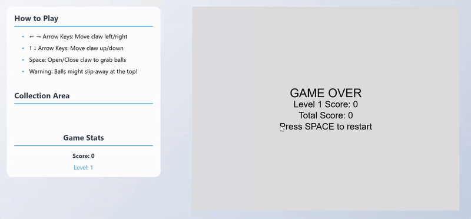

### Newly added features :
1. Timer System : I added a 60-second time limit per level. The player must reach required points before time runs out (I increment the number of points by 50 for each e level).
2. Progressive Difficulty : I made sure to change the logic of the game so that balls move faster in higher levels. One important point that I have worked on for this iteration is that initial velocity increases with level. There are alsomfewer but more valuable balls in later levels.
3. Scoring System Improvements: There are level-specific scores. I also added total score tracking. Players are required to reach a points threshold for each level. To make it easier for players to keep track of their points : score resets between levels.
4. Ball Behavior Enhancement: I worked on implementing escape mechanics when claw approaches using friction and bounce physics. To make each level more difficult, speed limits increase with each level. There are also more predictable movement patterns.
5. UI Improvements : To improve the UI, I worked on auto-hiding status messages.I added Game over screen with total score, a collection area with the number of each type of collected ball.

## Questions I am trying to answer : 
1. How to create meaningful progression within my game?
2. What is the best way to balance difficulty across levels?
3. How to make sure that my game stays challenging but fair?
4. How to make sure that the provided feedback for players is clear and time sensistive?
5. How to maintain player engagement all throughout the game?

### Describe the type of prototype/fidelity level/tools :
- Fidelity Level: This is a medium to high prototype.
- Tools: I used p5.js for game mechanics, HTML/CSS for building the UI of my game.
- Type: This is a functional prototype because it makes use of the whole game loop.
- Focus: The focus of this prototype was on game mechanics.

### Learned Lessons 
- Time pressure adds excitement without frustrating players
- Progressive difficulty keeps the game challenging
- Clear feedback helps players understand their progress
- Balance between random and predictable ball movement is crucial
- A simple and Compact UI helps maintain focus on gameplay

### Next Steps 
1. Add sound effects for better feedback.
3. Add power-ups or special balls.
4. Create tutorial level.
5. Add visual effects for level transitions.
6. Create visuals for bats/vampires to replace current ball objects.
7. Implement the main game storyline within game mechanics.

## Fang & Claw: A Grabby Situation (Iteration 4) | 03.27.25

## Overview
This iteration focuses on enhancing player feedback, introducing a power-up system, improving UI responsiveness.

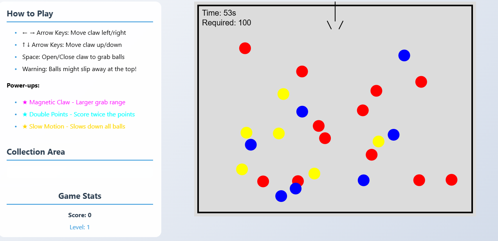

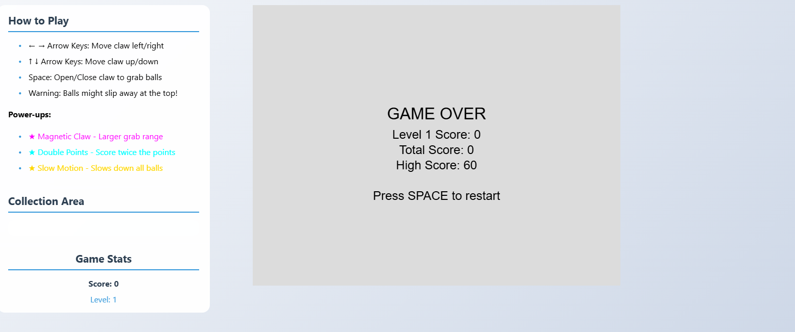

## What is the objective of this iteration ? : 
- I made sure to enhance player feedback with sound and visual effects.
- I implemented a power-up system for gameplay variety.
- I improved UI responsiveness and messaging.

### Newly added features :
## 1.Sound System Integration
- grab.mp3 – Claw grabbing balls. - source : https://pixabay.com/sound-effects/ding-1-14705/
- drop.mp3 – Balls being dropped. - source : https://pixabay.com/sound-effects/thud-291047/
- collect.mp3 – Successful ball collection.- source : https://pixabay.com/sound-effects/reload-123781/
- levelup.mp3 – Level completion.- source : https://pixabay.com/sound-effects/c-chord-83638/
- gameover.mp3 – Game over state.- source : https://pixabay.com/sound-effects/playful-failure-310480/

## 2.Power-Up System
- Magnetic Claw (Purple): Increases grab range.
- Double Points (Cyan): Doubles score for collected balls.
- Slow Motion (Gold): Reduces ball movement speed.

## 3.Enhanced Message System
- Auto-hiding messages with varied durations.
- Color-coded feedback: Green = (points gained), Red = (losses).
- Improved positioning and styling.

## Questions I am trying to answer : 
- Are power-ups intuitive and impactful?
- Does audio feedback enhance engagement?
- Is the feedback system clear and satisfying?
- How to manage multiple power-up effects effectively?
- How to balance visual feedback without overwhelming players?

### Describe the type of prototype/fidelity level/tools :
- Fidelity Level: This is a medium to high prototype.
- Tools: I used p5.js for game mechanics, HTML/CSS for building the UI of my game, p5.sound for audio handling.
- Type: This is a mix of implementation prototype, and look & feel prototype.
- Focus: The focus of this prototype was on  sound system, power-ups, UI, visual feedback.

## Lessons Learned
- Proper error handling is essential for sound loading.
- Auto-hiding messages improve game flow.
- Power-up effects need distinct visual indicators.
- Auto-hiding messages maintain fluidity in gameplay.
- Sound effects enhance immersion.
- Visual feedback clarifies game events.

## Next Steps
1. Add particle effects for power-up collection.
2. Improve power-up visual indicators.
3. Enhance level transition animations.
4. Implement a combo system.
5. Add more power-up types.
6. Create an achievement system.
7. Optimize sound loading.
8. Implement screen shake effects.
9. Add a settings menu.
10. Improve power-up status display.

## Fang & Claw: A Grabby Situation (Iteration 5) | 04.03.25

## Overview
This iteration focuses on the visual aspect of the game.

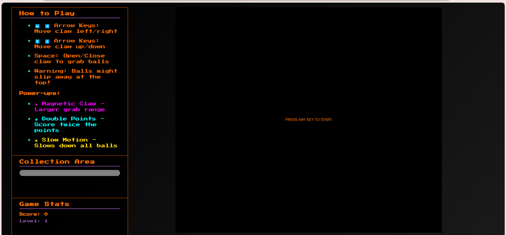

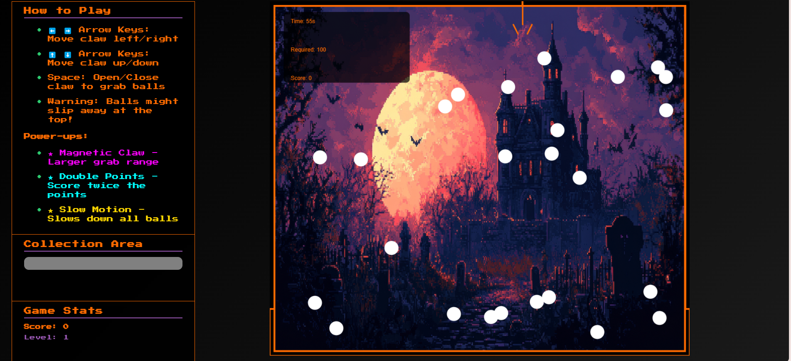

## What is the objective of this iteration ? : 
- I made sure to enhance player feedback with sound and visual effects.
- I improved the overall style of the game.
- I added stock images to enhance game storytelling.

### Newly added features :
## 1.Added New Sounds 
- background_sound.mp3 – Background game music.- source : https://pixabay.com/music/video-games-pixel-fight-8-bit-arcade-music-background-music-for-video-208775/
- gameover.mp3 – Game over state.- source : https://pixabay.com/sound-effects/game-over-38511/

## 2. Added Adobe Stock images to the game
- dracula.png - source : https://stock.adobe.com/ca/search/images?filters%5Bcontent_type%3Aphoto%5D=1&filters%5Bcontent_type%3Aillustration%5D=1&filters%5Bcontent_type%3Azip_vector%5D=1&filters%5Bfetch_excluded_assets%5D=1&filters%5Binclude_stock_enterprise%5D=1&filters%5Bcontent_type%3Aimage%5D=1&k=pixelated+vampire&order=relevance&price%5B%24%5D=1&search_page=1&search_type=usertyped&acp=&aco=pixelated+vampire&get_facets=0&asset_id=1092292850
- game_over.png - source : https://stock.adobe.com/ca/search/images?filters%5Bcontent_type%3Aphoto%5D=1&filters%5Bcontent_type%3Aillustration%5D=1&filters%5Bcontent_type%3Azip_vector%5D=1&filters%5Bfetch_excluded_assets%5D=1&filters%5Binclude_stock_enterprise%5D=1&filters%5Bcontent_type%3Aimage%5D=1&k=pixelated+vampire&order=relevance&price%5B%24%5D=1&search_page=1&search_type=usertyped&acp=&aco=pixelated+vampire&get_facets=0&asset_id=592295840
- main_background.png - source : https://stock.adobe.com/ca/search/images?k=pixelated+horror+game&search_type=usertyped&asset_id=1016525102
- mice.png - source : https://stock.adobe.com/ca/search/images?filters%5Bcontent_type%3Aphoto%5D=1&filters%5Bfetch_excluded_assets%5D=1&filters%5Binclude_stock_enterprise%5D=1&filters%5Bcontent_type%3Aimage%5D=1&k=pixelated+mice+character&order=relevance&limit=100&search_page=1&search_type=usertyped&acp=&aco=pixelated+mice+character&get_facets=0&asset_id=710020059

## 3. Improved styles.css
- Start game/sound on any button press.
- Implement a horror-style palette.
- Make sure game elements size stays consistent for all screen sizes and ratios.

## Questions I am trying to answer : 
- How does audio-visual synchronization affect player immersion ?
- How to create tension through UI elements ?
- What's the right balance for information density ?

### Describe the type of prototype/fidelity level/tools :
- Fidelity Level: This is a medium to high prototype with refined visual feedback, sound integration, and smooth transition.
- Tools: I used p5.js for game mechanics, HTML/CSS for building the UI of my game, p5.sound for audio handling.
- Type: This is a  look & feel prototype.
- Focus: The focus of this prototype was visual feedback, styling of the game and overall graphics.

## Lessons Learned
- Game components should keep the same size/ratio/position on all screen sizes.
- To improve game's overall visual identity, make sure to follow a clear color palette.
I decided to keep my color palette simple with tones of black, purple, orange, green, and blue
which reminds of a horror game style.
- Players should only be able to to start playing the game as soon as they press a button.
- The same logic applies to sound being played to avoid issues with p5.sound not playing sound
properly.
- To simplify game styling, use already available stock images provided with the Adobe Stock educational license.

## Next Steps
1. Add a start screen
2. Implement a story mode so that player goes through a story everytime he strats the game.
3. Implement game characters design into claw machine mechanics. (For example, when a ball is caught it can be either a mouse
or a bat). And the player gains points if he catches a mouse and loses points if he catches a bat.

## Fang & Claw: A Grabby Situation (Iteration 6) | 04.10.25

This iteration focuses on the visual aspect of the game as well as the functionality. I made sure to have consistent styles for the 
whole game with assets that correspond to this style. I made sure to combine png assets from Adobe Stock with assets created by AI 
which I have manually photoshopped later so it fits well in my game. When the user first starts the game there is a story mode they have to go through at the beginning of the game by pressing SPACE. I also reworked the functionality of my game. Users can no longer catch bats in batches without the magnetic claw powerup.

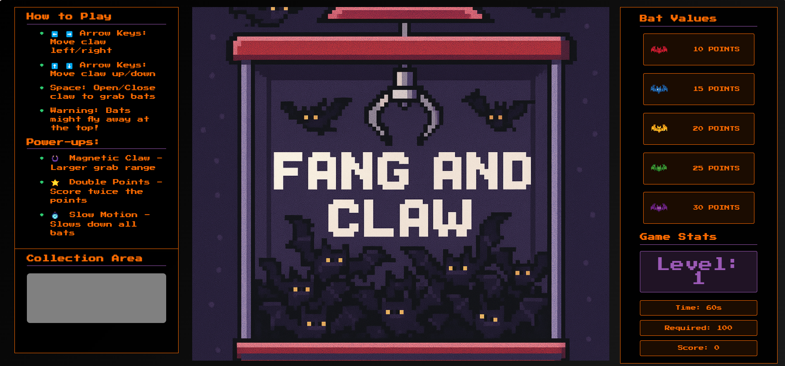

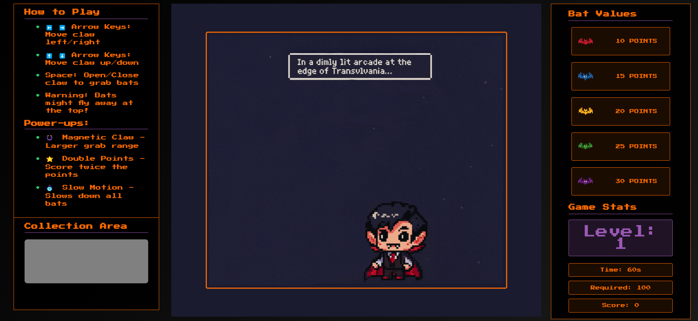

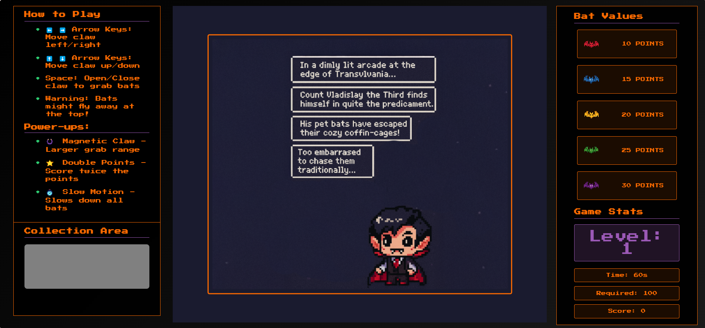

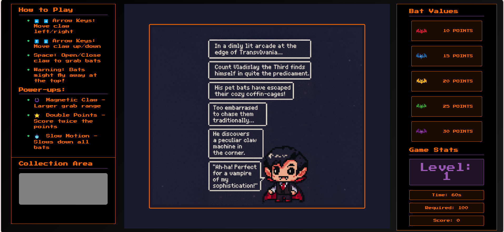

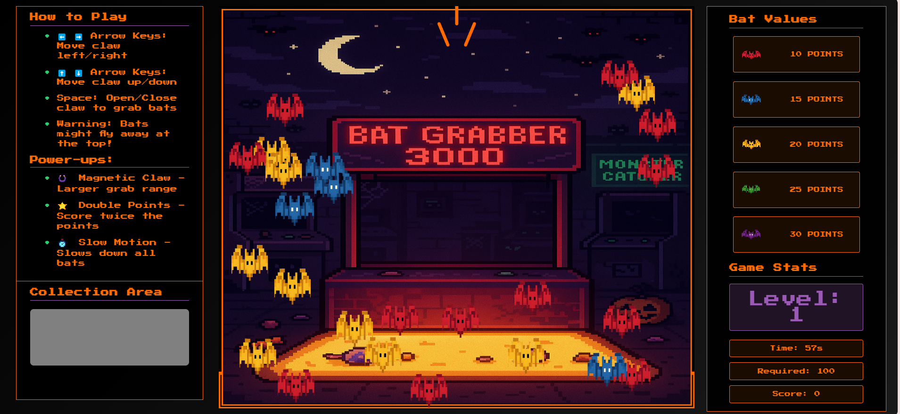

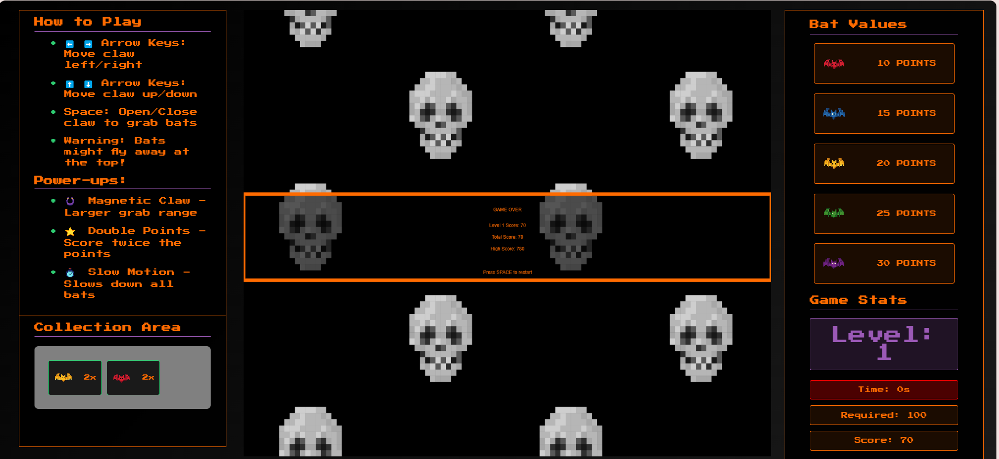

## What is the objective of this iteration ? : 
- Focused on both visual design and functionality improvements.
- Ensured consistent visual style across the entire game.
- Used a combination of:PNG assets from Adobe Stock.AI-generated assets, manually edited in Photoshop to match the game's aesthetic.
- Introduced a story mode at the beginning of the game:
- Activated by pressing the SPACE key.
- Reworked gameplay functionality:
- Players can no longer catch multiple bats at once.
- The magnetic claw power-up is now required to catch bats in batches.

### Newly added features :
## 1.New PNG assets (AI-generated & Photoshop) 

- dialogue1.png to dialogue6.png : Manually Created Assets in Photoshop by combining dracula.png and text
- blue_bat : Cropped AI-generated asset from Dalle-3 promt : generate an image of 6 pixelated bats in red, blue, yellow, green, purple
- green_bat : Cropped AI-generated asset from Dalle-3 : promt : generate an image of 6 pixelated bats in red, blue, yellow, green, purple
- orange_bat : Cropped AI-generated asset from Dalle-3 promt : generate an image of 6 pixelated bats in red, blue, yellow, green, purple
- red_bat : Cropped AI-generated asset from Dalle-3 promt : generate an image of 6 pixelated bats in red, blue, yellow, green, purple
- purple-bat : Cropped AI-generated asset from Dalle-3 : promt : generate an image of 6 pixelated bats in red, blue, yellow, green, purple
- yellow bat : Cropped AI-generated asset from Dalle-3 promt : generate an image of 6 pixelated bats in red, blue, yellow, green, purple
- starter_image : AI-generated asset from Dalle-3 with the promt : Generate a cover image for an arcade pixel style video game called fang and claw with font style 'Press Start 2P', cursive; where you have the title of the game in the middle, and pixel bats in a claw machine and written press space to start at the bottom
- magnetic_claw.png : Cropped AI-generated asset from Dalle-3 with the promt : Create me images of 3 pixelated things for these game powerups (and image of powerup description)
- double_point.png : Cropped AI-generated asset from Dalle-3 with the promt : Create me images of 3 pixelated things for these game powerups (and image of powerup description)
- slow_motion.png : Cropped AI-generated asset from Dalle-3 with the promt : Create me images of 3 pixelated things for these game powerups (and image of powerup description)
- main_background.png : AI-generated asset from Dalle-3 with the promt : Give me a good background for my claw machine game where I will put these bats

## 2. New Game Panel (Right side)
- Added a right side panel 
- It contains instructions for how many points each bat generates as well as Game Stats (level, time, required, score)

## 3. Added A Story Mode
- Quick story mode at the beginng of the game
- User must click SPACE to go through it
- Increases User Engagement

## Questions I am trying to answer : 
- How to make the claw feel responsive yet challenging to control?
- Is the magnetic claw power-up (allowing 2 bats) meaningful enough?
- What's the right balance between challenge and satisfaction in catching bats?
- How should bats behave when escaping the claw? (Enhanced escape behavior with randomness)

### Describe the type of prototype/fidelity level/tools :
- Fidelity Level: This is a high fidelity prototype. It has full gameplay implementation with working mechanics.
- Tools: I used p5.js for game mechanics, HTML/CSS for building the UI of my game, p5.sound for audio handling.
- Type: This prototype is well beyond a proof-of-concept, it can be used for gameplay testing.
- Focus: It has a complete UI system with visual feedback as well as an integrated sound system, as well as score tracking and a level progression system.

## Lessons Learned
- Need to implement good error handling for the sound system.
- I need to make sure canvas sizinf is responsive and maintains aspect ratio on al screens.
- Story Mode allows for better gameplay.
- Power-up effects need clear visal and mechanical differentiation.
- My code needs to be organized according to physics, rendering, UI, sound and assets.
- Iterative developemnt makes for a better final product.

## Next Steps
1. Improve look and feel of Game Over page.
2. Fix text sizing issues inside canvas.
3. Increase game difficulty.